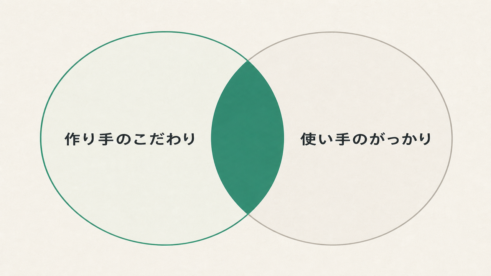
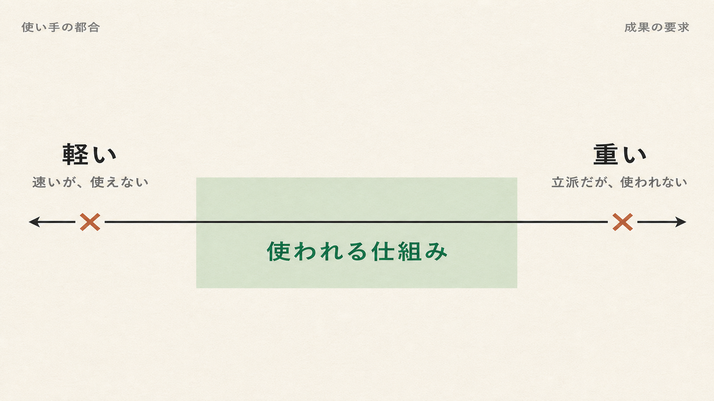

【BizDev公開日誌 #9】

私たちがAIプロダクトを作っていくなかで陥りがちな罠の一つに、高い品質のものを作れば使ってもらえる、という思い込みがあります。

もちろん、品質は高いに越したことはないですし、成果を出すために必要な品質は担保しなければなりません。ところが、こだわって開発したものほど、社内の現場に思うように浸透しない。開発と現場浸透を並行で進めるなかで、品質へのこだわりが浸透の邪魔をしている、という事実に行き当たりました。

## 「良いものを作れば使われる」は、半分しか正しくない

実際に現場で出た「使われない理由」は、拍子抜けするほどシンプルでした。「（精度を上げるための処理で）重くなって実用的じゃない」「最初のアウトプットが微妙で、使う気がなくなった」。

前者は、案件ごとのインプット情報を3C（生活者・競合・自社）の観点で詰め込みながら、処理ごとにサブエージェントを立て、セルフレビューも合格点が出るまで繰り返す…といった、理想的ではあるが複層的な処理にした結果でした。精度は一定上がるものの、それ以上に実行時間と処理コストが重くなってしまった。

後者は、AIでバナーを作るとき、画像の出来以前にコピーが微妙だと全体が「うーん」となってしまい、先に進めなかったという例です。一度それを味わうと、「やっぱり自分でやった方が早い」に直結してしまう。

もちろん、品質にこだわること自体は間違っていません。問題は、こだわる矛先を正しく見極めることでした。私たちが磨きたい部分と、使い手ががっかりする部分は、一部しか重ならない。どこの品質を上げるかは、作り手のこだわりではなく、使い手のがっかりが決める ― 改めてそう痛感しました。

## 成果に向き合うほど、プロダクトは重くなる

さらにいうと、矛先を使い手に合わせれば済む、という単純な話でもありません。もう一つ、逆向きの力が働きます。

私たちのプロダクトは、最終的に広告の成果につながらなければ意味がありません。成果に本気で向き合うほど、品質を担保するためのチェックや検証の工程は増えていきます。たとえばAIに全自動で作らせる「オートモード」は手軽ですが、便利だからと使うと、途中の品質チェック（人が確認するHuman-in-the-Loopのステップ）が省略され、がっかりな出力が出てくる。

かといって、全部の工程を丁寧に通すと、今度は重くて使われない、というジレンマに陥ります。

つまり、手軽さと成果も、トレードオフで引っ張り合う瞬間があります。軽くすればがっかり品質に近づき、成果を狙って重くすれば使い勝手が落ちる。#6では「作ったものを検証する側の認知負荷」を書きましたが、その負荷は、成果に向き合うほど避けがたく増えていくものでした。

[PUNCHLINE] 軽くすればがっかりに近づき、重くすれば使われなくなる。

## 二つの力は、逆を向いている

ここが、議論していて一番やっかいだった点です。

一つ目の力は「使い手に寄せて、品質の軽重をつけろ」と言う。二つ目の力は「成果を狙うなら、重さを引き受けろ」と言う。方向が逆なんです。だから「使い手目線に寄せれば浸透する」とも、「成果のために品質を固めれば浸透する」とも、どちらも単純には言い切れない。

今のところ一番効いているのは、改めて原理的な目線に立ち返ることでした。設計段階で成果に効くと見極めた要素を、もう一度シャープに問い直して担保する。同時に、使い手として使いやすいと思えるだけのスピードや品質も確保する。さらにリリースした後も、ユーザーの横に張り付いて磨き込む。逆を向いた二つの力を、人が手で吊り合わせるプロセスです。

UX/UIといってしまえばそれまでですが、爆速であらゆる開発が進むからこそ、こうしたプロセスを置き去りにせず、かといって初動を遅らせず、アジャイルに開発し続ける意識とプロセス設計が大事になります。

## 結論が出なかった問い

使い手の軽重と、成果のための重さ。逆を向いた二つを、どこで折り合わせればプロダクトとして成立するのか ― これがいちばん難しい問いでした。

軽さに倒せば「速いけど使えない」になり、品質に倒せば「立派だけど重い」になる。その折り合いの点は、たぶん商材や現場ごとに違う。だとすれば、作り手が一度きれいに設計して終わり、という性質のものではないのかもしれません。横で一緒に作るのが効くのも、その点を毎回ずらしながら探っているからな気がします。

この問いにも、当然まだ答えは出ていません。場合分けも検討しながら、線引きを模索していければと考えています。

## まとめ

- 「良いものを作れば使われる」は半分しか正しくない ― 品質のこだわりが浸透を邪魔することがある
- どこの品質を上げるかは、作り手のこだわりではなく使い手のがっかりが決める
- 一方で成果を狙うほど品質は重くなる ― 軽さ（使い勝手）と重さ（成果）は逆を向き、その折り合いがまだ設計できていない

---

良いものを作りたい、という気持ちは本物です。でもその「良い」を、作り手の達成感で決めた瞬間、使い手とも成果ともずれていく。

私たちはまだ、こだわりの矛先と重さを、使い手と成果のあいだのどこに置けばいいのか決めきれていません。決めきれていないと自覚し続けることだけが、いま手にしている唯一の手がかりです。

[PUNCHLINE] 「良い」を作り手の達成感で決めた瞬間、使い手とも成果ともすれ違う。

---

## 次に読む

この記事が参考になったら、ぜひ以下もご覧ください。

[カードリンク: 【BizDev公開日誌 #6】AI時代の認知負荷を再設計する ― HITLの5軸/4原則]

[カードリンク: 【BizDev公開日誌 #8】AIで作るAIプロダクトの開発プロセス]

## BizDev公開日誌シリーズ

[カードリンク: シリーズまとめ記事/ハブ記事]

---

📚 BizDev公開日誌シリーズは毎週更新中。
マガジンをフォローすると新着通知が届きます。

---

#AIBizDev #ノバセルBizDev #AI事業開発 #AI導入 #プロダクト浸透
