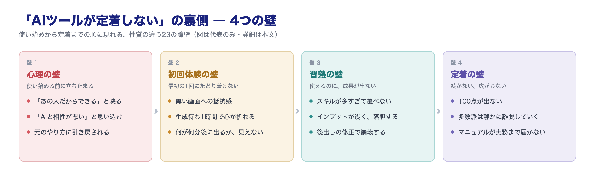
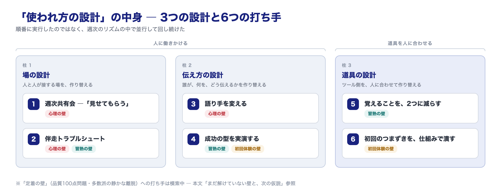
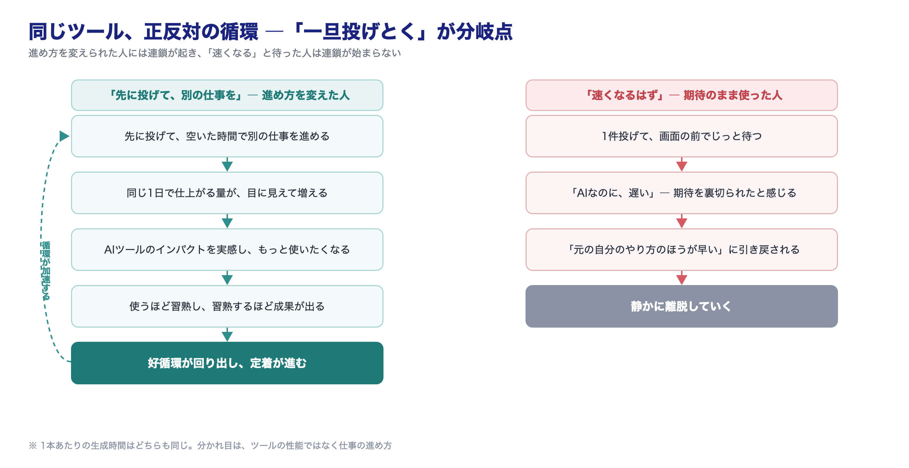

【BizDev公開日誌 #11】

私たちはこの数ヶ月、広告クリエイティブ制作のためのAIツール群——字コンテ、バナー、LPを生成するスキル——を開発し、クリエイティブ制作チームに使ってもらう取り組みを続けてきました。

品質には手応えがありました。実際に触ってもらえば、価値は伝わるはずだと。

けれど、現実はそう単純ではありませんでした。何が起きていて、どこに壁があり、何が効いたのか——AIツールが現場に定着するまでの数ヶ月を、この記事に記録します。

## つくる側の誤算 ―「いいツールなら使われる」は幻想だった

振り返ると、私たちの頭の中には素朴な方程式がありました。「品質の高いツールを作る → 触ってもらう → 価値が伝わる → 使われる」。だから品質を磨くことに時間を使い、使われない理由もまず品質に求めました。

でも、現場で起きていたことは違いました。

- ツールは使われている。しかし出力への修正が多く、「結局手直しするなら……」という空気が漂う
- 丁寧に作ったマニュアルが、ほとんど参照されていない
- 質問が来ない。うまくいっていないのに、何も聞かれない
- 生成待ちの時間に、誰にも言わずに諦めている人がいる

「使われていない」のではなく、「使われているのに、定着していない」。この症状の正体を特定しないことには、打ち手の立てようがありませんでした。

## 教科書だけでは現場は変えられない。

取り組み始めた当初、私たちはまず先人の知恵に頼ろうとしました。AX・DX関連の書籍やWeb記事を片っ端からあたりましたが、出てくるのは「ビジネスモデルを変革せよ」という壮大な話ばかり。「現場のクリエイターにAIツールを使ってもらうには、具体的にどうすればいいか」という粒度の情報は、ほとんど存在しませんでした。

考えてみれば当然で、この粒度の試行錯誤は各社の現場の中に埋まっていて、外には出てきません。答えが外にないなら、自分たちの現場で見つけるしかない。

そこで土台にしたのが、週次の「AI制作共有会」です。クリエイティブ制作チームの一人ひとりに、その週に何を作り、どこで詰まったかを、口頭の報告ではなく実際の画面やアウトプットと一緒に持ち寄ってもらう。うまくいった話だけでなく、失敗も同じテーブルに載せる。

これを続けて分かったのは、ヒアリングで「困っていることはありますか」と聞いても本音は出てこない、ということです。実物を見せてもらうと、本人が課題と認識していないつまずき——変な回り道、惜しい入力、諦めの早さ——まで見えてきます。

## 使いこなしを阻む「4つの壁」― 観測してわかった障壁の全体像

毎週の観測を続けると、「定着しない」という1つの現象の裏に、性質のまったく違う壁が何層も重なっていることが見えてきました。使い始めから定着までの順に、大きく4種類あります。

### 心理の壁 ― 使い始める前に立ち止まる

最初の壁は、ツールに触れる前の心の中にあります。

- **推進側の成功事例は「あの人だからできる」と映る。** 作った本人がうまく使えるのは当たり前で、聞く側にとっては自分ごとにならない
- **エラー続きで「自分はAIと相性が悪い」と思い込む。** 実際には認証や環境設定の問題なのに、連続でつまずいた人はそれを自分の適性の問題として受け止めてしまう
- **「元の自分のやり方のほうが早い」に引き戻される。** 初期の試行錯誤コストは、手慣れた従来手法への強力な引力になる
- **忙しくて、新しいやり方を試す余裕がない**
- **不満やつまずきを、自分からは言い出せない。** 聞かれても「大丈夫です」と答えてしまう
- **AIで作った成果は、実力を割り引いて見られる気がする。** 使うほど評価が下がるかもしれない、という漠然とした不安

やっかいなのは、この壁が「見えない」ことです。本人は何も言わずに、ただ使わなくなります。

### 初回体験の壁 ― 最初の1回にたどり着けない

心理の壁を越えて「試してみよう」と思った人を、今度は物理的なつまずきが待ち構えます。

- **黒い画面（ターミナル）への抵抗感。** 非エンジニアにとって、あの画面は「自分の領域ではない」というサインに見える
- **認証・APIキー・アクセス権など「スキル以前」の手続きで止まる。** ツールの良し悪し以前に、スタートラインに立てない
- **実行環境によって挙動が違い、謎のエラーに当たる。** 同じスキルなのに、人によって動いたり動かなかったりする
- **裏側処理の承認を何度も求められ、判断がつかない。** 「この処理を許可しますか」と聞かれても、内容を見て判断できる人はいない
- **生成待ち30分〜1時間で心が折れる。** 画面の前でじっと待った人は、確実に離脱する
- **何を入れたら、何が、何分後に出るのか、先が見えない。** 見通しのない待ち時間は、実際より何倍も長く感じられる

初回体験でつまずいた人の再挑戦率は、体感でかなり低い。「最初の1回」の設計は、それほど重要でした。

### 習熟の壁 ― 使えるのに、成果が出ない

最初の1回を越えても、「使える」と「成果が出る」のあいだには、まだ距離があります。ここが成否の分岐点でした。

- **スキルが多すぎて、どれを使えばいいか分からない。** 作った側には自明でも、使う側から見ればカタログのないツール棚
- **告知が分散して、スキルの存在自体を知られない。** 新しいスキルの案内が各部署のチャンネルにバラバラに流れ、届く人にしか届かない
- **インプットが浅いまま走らせて、出力に落胆する。** 頭の中の情報を言語化せずに投げると、それなりのものしか出てこない
- **出力を見てから、後出しの修正を重ねて崩壊する。** 完成物を見てから直したくなるのは人間の性だが、工程を無視した修正は制作の流れ全体を壊してしまう
- **工程の仕組みを知らず、反映されない指示をしてしまう。** どの段階で何が確定するのかを知らないと、指示が空振りする
- **うまくいかない時、粘るか引き直すかを判断できない。** 悪い出力に固執して修正を重ねるより、ゼロから再生成したほうが早い場面は多い

### 定着の壁 ― 続かない、広がらない

そして最後に、使い続けてもらうための壁が残ります。

- **100点が出ない。**「結局手直しするなら、自分でやったほうが……」という論理は、それなりに正しいだけに強い
- **多数派は細かい使いにくさで、静かに離脱していく。** アーリーアダプターは多少の不便を我慢してくれるが、品質基準の厳しい多数派は不便を口に出さずに離れる
- **マニュアルが「作り方」止まりで、実務まで完結しない。** 生成のやり方は書いてあっても、クライアントの修正要求に応えて「完成させる」までの手順が書かれていない
- **AIを使えない案件があり、使う習慣が途切れる。** 商材や規制の制約で使えない案件を挟むと、せっかくの習慣がリセットされる
- **利用上限・クレジット切れで、勢いが止まる。** 乗ってきたタイミングでの強制停止は、想像以上に熱を冷ます

## 壁への対処 ―「使われ方の設計」は、3つの設計だった

壁の全体像が見えてから、私たちは打ち手を重ねていきました。あとから振り返ると、やっていたことは3種類の「設計」に整理できます。**場の設計、伝え方の設計、道具の設計**。ツールそのものではなく、「使われ方」を設計し直す——その中身がこの3つです。

断っておきたいのは、これらを順番に実行したわけではない、ということです。3つの設計は、週次のリズムの中で並行して回し続けました。そしてもう1つ、4つの壁をすべて崩せたわけでもありません。どの壁が残っているかは、最後に正直に書きます。

### 柱1【場の設計】― 人と人が接する場を、作り替える

ツールを配って個人に任せきりにすると、つまずきは誰にも気づかれないまま放置されます。そこで、人が集まる「場」を意図的に用意しました。みんなで見せ合う場と、1対1で寄り添う場の2つです。

#### 打ち手① 週次共有会 ―「言えない」を「見せてもらう」に変えた

**→ 心理の壁「言い出せない」／全打ち手の観測基盤**

共有会でのポイントは、「困っていることはありますか」と聞くのをやめて、「今週作ったもの、ちょっと画面ごと見せてください」に変えたことです。すると、本人が課題と思っていないつまずきが山ほど見つかります。逆に、こちらが想像もしていなかった上手な使い方も見つかる。成功と失敗の両方が同じテーブルに載ることで、後述する「分岐点の分析」が可能になりました。

言い出せない人から話を引き出す最良の方法は、話させることではなく、見せてもらうことでした。

#### 打ち手② 伴走トラブルシュート ― 隣に座って、一緒に切り分ける

**→ 心理の壁「自分はAIと相性が悪い」／習熟の壁「個別案件でつまずく」**

共有会がN対Nの場だとすれば、こちらは1対1の場です。

スキルは汎用的に作りますが、案件は1つひとつ事情が違います。この商材ではこの表現が使えない、このクライアントは素材の要件が特殊——**個別案件の事情に合わせてスキルを使いこなせるようになるまでは、最初は隣に座って一緒にやるしかない**。それが伴走です。

やること自体は派手ではありません。つまずいているメンバーと画面を一緒に見ながら、問題を1つずつ切り分ける。あるメンバーは、エラーが続いて「僕だけ、AIと相性が悪いんですよね」と言っていました。しかし一緒に画面を見ていくと、原因は本人ではなく認証まわりの環境設定。切り分けてしまえば、その日のうちに解決する話でした。ここで大事なのは速さです。**環境の問題を「自分の適性の問題」と誤認したまま放置すると、その人は二度と戻ってきません。**

伴走の場では、運用のコツもその場で合意していきました。「初稿は70点でいい。仕上げは役割分担しよう」「うまくいかない出力に修正を重ねるより、ゼロから引き直したほうが早い」。マニュアルに書いても読まれなかったことが、自分の案件を題材にすると、その場で身につく。一般論では動かない人も、自分の案件でなら動きます。

### 柱2【伝え方の設計】― 誰が、何を、どう伝えるかを作り替える

場が整っても、伝え方を間違えると人は動きません。私たちは「誰が伝えるか」と「どう伝えるか」の2つを作り替えました。

#### 打ち手③ 語り手を変える ― 説明するのをやめて、語ってもらう

**→ 心理の壁「あの人だからできる」**

当初の共有会では、私たちBizDev側が使い方や成功事例を説明していました。ただ、このやり方では浸透までに時間がかかりそうでした。作った本人がうまく使えるのは当たり前で、聞く側には「それはあなただからできる」と映りやすい。事例の数を増やしても、語り手が推進側である限り、「私でもできる」への変換はなかなか進まないのです。

そこで、共有会の構成を変えました。私たちが説明するのをやめ、クリエイティブ制作チームのメンバー自身にスピーカーになってもらい、成功事例を本人の言葉で、実際のデモを交えて語ってもらうことにしました。

効果ははっきり出ました。象徴的だったのが、メンバーの一人による動画素材の大量生成の回です。8シーン×2パターン、動画16本と静止画16枚、計32ファイルを、着手から納品まで1時間21分で仕上げた——従来の感覚なら「2〜3日はかかる」と誰もが見積もる分量です。本人が自分の画面で、どう指示し、どう待ち、どう仕上げたかを語ると、会の空気が変わる瞬間がはっきり分かりました。

「あの人ができたなら、私もできるかもしれない」。そしてもう1つ、「同じ職種の人がここまでやっているなら、自分もやらないとまずい」という健全な焦り。同じ現場の、同じ職種の人が語ることで、成功事例は初めて自分ごとになります。推進側が100回説明するより、現場の1回のほうが効く——この取り組みで最も確信を持てた学びの1つです。

#### 打ち手④ 成功の型を実演する ―「これだけ入れれば、これが出る」

**→ 習熟の壁「インプットが浅い」／初回体験の壁「先が見えない」**

共有会に成功例と失敗例の両方が持ち寄られるようになって、決定的な発見がありました。同じLP制作スキルを使った2つのケースが、対照的な結果になったのです。一方はほぼ一発でデザイナーとの合意まで進み、もう一方は修正が重なって崩壊しかけた。

分岐点は、スキルの性能ではありませんでした。うまくいったケースは、オリエンフォーマット——制作要件を整理する入力シート——を事前に詳細に詰め切ってから投げていました。どの訴求で、何を、どう作るか。入力に迷いがない状態でAIに渡している。うまくいかなかったケースは、入力を省略して頭の中の情報のまま走っていました。

この対比はそのまま、何よりの教材になりました。共有会で「これだけ入れれば、これが出てくる」を目の前で実演すると、意外なほど納得してもらえます。抽象的に「インプットが大事です」と言われても人は動きませんが、同じツールで成功と失敗が分かれた実例を見ると、行動が変わる。**インプットに迷いがなければ、AIは滑らかに走る**——この感覚を、実例の共有を重ねて広げていきました。

### 柱3【道具の設計】― ツール側を、人に合わせて作り替える

柱1・柱2は「人に働きかける」設計です。それに対して柱3は「道具を人に合わせる」設計。**人の行動を変えるには数ヶ月かかりますが、道具の側を作り替えるのは、AI時代には数日、ときには一晩でできます。**この非対称性は、定着を考えるうえで強力な武器になります。

#### 打ち手⑤ 覚えることを、2つに減らした ― 入り口の集約

**→ 習熟の壁「スキルが多すぎて選べない」「存在を知られない」**

スキルを増やすほど現場は便利になるはず——これも誤算でした。制作用のスキルが増えるにつれて、「どのスキルが何をしてくれるのか分からない」という声が増えていったのです。しかも新しいスキルの告知は各部署のチャンネルに散らばり、届く人にしか届かない。「スキルはあるのに、知られていないから使われない」という、もったいない状態が生まれていました。

対処はシンプルで、**入り口を集約する**ことでした。動画を作りたければ /video、バナーなら /banner。覚えるのはこの2つだけ。あとは要望を伝えれば、裏側で適切なスキルが自動的に選ばれて動きます。どのスキルを使うかという選択の複雑さを、ユーザーの手元からツールの裏側へ移した形です。

#### 打ち手⑥ 初回のつまずきを、仕組みで潰した

**→ 初回体験の壁「黒い画面」「承認の連打」「環境の劣化」**

初回体験の壁で見つかった物理的なつまずきを、1つずつ仕組みで潰していきました。

- 黒い画面に抵抗がある人には、デスクトップ版など親しみやすいUIを案内する
- 「この処理を許可しますか」の連打には、安全な範囲で自動承認されるモードでの起動方法を用意する
- ファイル環境が古くなって壊れる問題には、起動時に自動で最新化される仕組みを仕込む
- エラーや使い方の相談は、専用の窓口フォームに一本化して、たらい回しを防ぐ

1つひとつは地味です。しかし初回体験の壁は「細かいつまずきの積み重ね」でできているので、対処も積み重ねるしかありません。ここを「本人のリテラシーの問題」と片付けた瞬間に、定着は止まります。

## 結果、何が変わったか

数ヶ月の取り組みを経て、目に見える変化が出てきました。

- **スキルの利用率が、ほぼ100%になった。** クリエイティブ制作チームのほぼ全員が、日々の制作でスキルを使う状態になった
- **動画素材の大量生成が実案件で回り始めた。** 32ファイルを1時間21分で納品（従来の見積もりは2〜3日）。人が張り付いていた時間はほぼゼロ
- **メンバーがAIで制作したメインバナーが、複数案のコンペで採用された。** 速いだけでなく、品質で選ばれた
- **入力を詰め切って投げたLPが、構成修正なしの一発でデザイナー合意まで進んだ**
- **字コンテ素材の量産が定常化した。** 週次で成果物が積み上がるペースになった
- そして何より、**「生成を裏で回しながら別の仕事をする」働き方が、こちらが言わなくても自然に広がり始めた**

強調したいのは、この間、道具の性能はほとんど変わっていないことです。変わったのは、使われ方の設計——場と、伝え方と、道具。それでこれだけの差が出た——この事実が、私たちには何より重要でした。

## 学んだこと

この数ヶ月を振り返って、学びは2つに集約されます。

**1. 定着は、ツールの性能ではなく「使われ方の設計」で決まる。**
壁は性質の違うものが4種類重なっています。壁を特定しないまま打つ施策——研修、マニュアル、機能追加——は当たりません。まず観測し、壁を見極め、壁ごとに打ち手を変える。遠回りに見えて、これが最短でした。

**2. 最後の分かれ目は、仕事の進め方そのものを変えられるかだった。**

世の中のAI言説は「速くなる」一色で、私たちも最初はそう伝えていました。しかし、AIツールの実態は、作業の高速化というより**業務の代行**に近い。ちゃんとした成果物を作り込ませれば、動画素材の生成なら30分から1時間かかります。「速い」と期待した人が画面の前で1時間待たされれば、裏切られたと感じるのは当然でした。だから伝え方を変えました。「速くなります」ではなく、**「時間はかかります。だから先に投げておいて、別の仕事をしてください」**。

振り返ると、この「一旦投げとく」ができるようになるか——仕事の進め方そのものを変えられるか——が、定着した人としなかった人の分かれ目でした。

進め方を変えられた人には、連鎖が起きます。先に投げて、空いた時間で別の仕事を進める。同じ1日で仕上がる量が目に見えて増える。ここで初めて**AIツールのインパクトを実感し**、もっと使いたくなる。使うほど習熟し、習熟するほど成果が出る——好循環が回り出して定着が進む、その最初の一押しが「進め方の転換」でした。逆に、「速くなる」を文字通りに受け取ったまま1件投げては待つ使い方をしていると、この連鎖は始まりません。待たされ、失望し、静かに離れていく。そして「速くなる」を文字通りに受け取っている人は、想像以上に多い。**この期待値のズレを最初に解消しておくことが、意外なほど大事な分岐点になります。**

進め方が変わると、生産性の景色も変わります。1本あたりの生成時間は昔と同じでも、20本を並列で投げれば1時間後には「1本あたり実質数分」。AIの生産性は「1タスクが何分速くなったか」ではなく**「裏で何本並列で走っているか」**に現れ、それが組織に馴染んだとき、1人が同時に担当できる案件数という形で、初めて経営レベルの数字が動き始めます。

## まだ解けていない壁と、次の仮説

もちろん、すべての壁を越えられたわけではありません。

出力の満足度は、まだ100点には届きません。修正がゼロにならない中で、どこまで品質を追い込むべきか。品質基準の厳しい多数派は細かい使いにくさで静かに離脱していきますが、その一人ひとりに、どこまで個別に手を打つべきか。ノウハウが特定の個人の頭の中に溜まっていく属人化も、まだ解決できていません。

こうした残りの壁に対して、いま仕込み始めているのが観測の仕組み化です。共有会という観測には限界があります。静かに離脱していく人は、場には現れないからです。そこで、スキルの利用ログを自動で蓄積する仕組みを一部動かし始めました。本格化はこれからですが、ログから課題を抽出し、必要な人に知らせ、スキルの改善へ半自動で反映していく——**道具が自分で進化していく循環**を作れるかが、次のテーマの1つです。

そして最大の問いは、「人を変える」から「道具を合わせる」への傾斜を、どこまで進めるかです。柱3（道具の設計）で手応えを得た方向の延長線上には、会議の議事録から初稿が自動で生成されていて、人は結果を確認するだけ——という世界が、技術的にはすでに見え始めています。プロセスそのものをなくしてしまえば、浸透という問題自体が消える。しかしそれは、現場の育成や、品質を見る目をどう維持するかとのトレードオフでもあります。

この問いに、まだ答えは出ていません。

ツールを作る仕事から、使われ方を設計する仕事へ。私たちは軸足を移すことに決めました。まだ道半ばです。それでも、現場の一次情報を毎週観測しながら、「作った」と「使われている」のあいだを、埋め続けていきます。

---

## 次に読む

この記事が参考になったら、ぜひ以下もご覧ください。

https://note.com/rapid_yeti215/n/n41e94ac0d832
<!-- カードリンク: AIは「作って配る」だけでは使われない ― 橋渡しという仕事。note入稿時、上のURL単独行が自動でカード化されます -->

## BizDev公開日誌シリーズ

[カードリンク: シリーズまとめ記事/ハブ記事]

---

📚 BizDev公開日誌シリーズは毎週更新中。
マガジンをフォローすると新着通知が届きます。

---

#AIBizDev #ノバセルBizDev #AI事業開発 #AI定着 #生成AI活用
