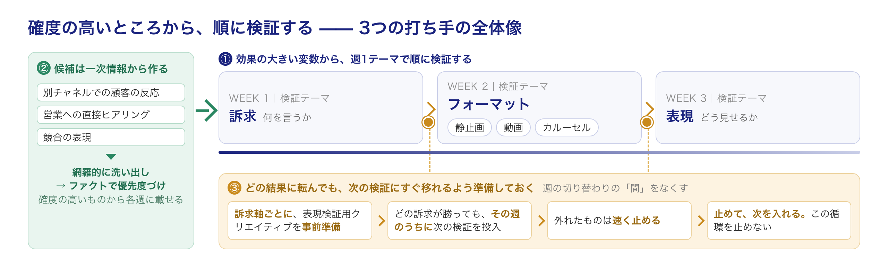

【BizDev公開日誌 #12】

私たちはこれまで、静止画や動画などの広告クリエイティブを生成するAIエージェントを中心に、マーケティング業務を自動化するツールを作り、現場に提供してきました。

そんな中、BizDevチームが実際にデリバリを一気通貫で担当する機会に恵まれ、ある広告運用の案件を自分たちの手で回しました。

ツールを作った私たちが、実際の案件でAIをフルに使って運用したら、何が起きたか、どんな発見があったか。

結論から言うと、成果は出ました。ただし振り返って分かったのは、**成果を決めたのはAIによるクリエイティブの量産や効率化だけではなかった**、ということです。

AIで生産性がどれだけ上がっても、消えない制約がありました。その制約をどう乗り越えたか——そこに、今回の成功の本当の要因がありました。

## まず、AIでここまで回せた

先に、どれだけAIに任せられたかを書きます。この案件では、検証計画、クリエイティブ制作、振り返り、顧客報告など、多くの工程でAIを活用しました。

### 検証仮説の洗い出し：訴求候補やクリエイティブのデザインを広く洗い出して優先度をつける

最初にやったのは、何を訴求するか、どんな表現で伝えるのかの洗い出しです。

商材の基本情報や競合比較はもちろんのこと、架電など別の獲得チャネルにおける顧客の反応をAIで読み込み、インサイトを抽出しました。

また、競合や関連サービスの広告クリエイティブを収集するスキルで、訴求や表現のパターン数や配信期間を集計し、競合が多く・長く出している——つまり成功確度が高いと考えられる——表現パターンを抽出しました。

これらを総合して、検証にかける訴求軸やデザインを網羅的に洗い出し、優先順位をつけました。

### 制作：フルAIで大量に生成

クリエイティブの制作は、私たちがこれまで注力して開発してきたツールで、フルAIで作りました。

一度に数十本のクリエイティブを作り、良いものをピックアップする。**制作が検証速度の制約になることは、ありませんでした。**

### 審査：クリエイティブ提出フォーマット作成の自動化

審査工程では、クライアントから指定されたフォーマットで、動画を絵コンテ形式のファイルに整える必要がありました。

カットの抽出やナレーションの文字起こしから、フォーマットへの記入までを全自動で実施。せっかく作ったクリエイティブの配信が、後工程の手間で遅れることを未然に防ぎました。

### 振り返り：AIで瞬時に集計できるから、人間は仮説出しに集中できた

配信実績の集計は、MCP経由で自然言語で問いかけて、配信結果をブレイクダウンする形で行いました。アドセット別・属性別・時間帯別・配置別・クリエイティブ別。

特定の属性帯でコンバージョンがほぼ出ていないこと、ある配信面が別の配信面に対して大きな効率差を持つこと、勝ちクリエイティブの効率が悪化する日予算の目安など、多くの示唆を短時間で出すことができました。

集計作業に時間をかける必要がなくなったからこそ、何が問題なのかの仮説出しに人間の頭を使うことができ、有効な示唆にたどり着けました。

### 顧客報告：下書きはAI、確認は数分

日次レポートの下書きは、あらかじめ用意した集計観点をもとにメディアのMCPを呼び出し、コメント生成プロンプトで結果の説明文を生成する形にしていました。

人の確認は数分。無駄な部分を削るだけで、顧客に提出できるクオリティの下書きができていました。

### 成果

AIでクリエイティブを大量に生成し、その他のオペレーションも自動化して、人の手間を抑えました。

結果として、月次のCPAは最も悪かった月から翌月で3割以上改善し、最終週には案件を通じて最も良い水準に到達しました。

## でも、成功の要因はそれだけではなかった

振り返りの場で、メンバーから出た言葉があります。

「たくさん作って回して成果が出た、というだけじゃなかったよね」

というのは、それは事実の半分だからです。AIの活用によって成果が出せるようになったのは間違いない。でも、生産性が上がってもなお、**残っている制約がありました**。そしてこの案件で成果が出たのは、その制約に対して正面から設計をしたからでした。

## 残っていた制約：検証に使えるリソースは、有限だった

作れる量と、回せる量は別です。

クリエイティブは数十本単位で作れるようになりました。でも、それを配信に載せて検証するには、予算があり、顧客審査があり、検証にかけられるタイムリミットがあります。どれも限界がある。しかも——CPAが目標を達成したからといって、予算が急に増えるわけではない。事業計画は広告の調子とは別の論理で動いているからです。

つまり、検証に使えるリソースは有限で、その枠の中でどう最短で目標値に近づくかが基本になる。

回せる本数が有限だということは、**外した検証の1回が高くつく**ということです。かといって、同時に何本も走らせて変数を増やせば、何が効いたのか分からなくなる。だから私たちは、「何を・どの順で検証し・いつ止めるか」を綿密に設計しました。

打ち手は3つです。

## 確度の高いところから、順に検証する

### ①効果の大きい変数から、週1テーマで順に検証する

まず決めたのは、検証の順番です。

同時に何本も検証はできません。そこで週ごとに検証テーマを1つに絞り、「**訴求 → フォーマット（静止画/動画/カルーセル） → 表現**」の順で進めることにしました。成果への効き方が大きい変数から順に固めていく設計です。何を言うか（訴求）が外れていれば、どう見せるか（フォーマット・表現）をいくら磨いても意味がない。だから訴求から始める。このマップを顧客に事前に提示して合意しています。

順番が決まると、次の問題は「各週のテーマに、何を載せるか」です。

### ②各テーマで出すクリエイティブを、一次情報から作る

当然ではありますが、検証に制約があるのなら、いかに成功確度の高いクリエイティブを早期に出せるかが鍵になります。外した1回が、そのまま1週間の損失になる。

だから訴求や表現を手がかりとなるファクトに基づいて確度の高いものから実行しました。

まず、見落としがないようにできるだけ網羅的に洗い出した上で、ファクトに基づいて優先度をつける。前段で書いたとおり、材料にしたのは架電など別チャネルでの顧客の反応、営業への直接ヒアリング、競合クリエイティブの表現です。

この作業が、早期の成果に繋がりました。

訴求軸の観点ではそれまで見落としていたものが当たり、表現の観点では他社で長期配信されていたものを起点に制作したものが効果を出しました。

### ③どの結果に転んでも、次の検証にすぐ移れるように準備しておく

順番を決め、確度の高い候補を載せても、結果がどう出るかは事前には分かりません。勝つ訴求もあれば、外れる訴求もある。

ここで大事なのは、**結果が出た瞬間に、次の検証へ移れること**です。検証にかけられる時間は有限です。結果を見てから次のクリエイティブを作り始めると、その制作と審査にかかる期間のぶんだけ検証が止まる。週1テーマで進める設計が成立するかどうかは、この「間」をなくせるかで決まります。

だから目指していた状態は、大量に作って大量に配信することではなく、**「Aが当たったら次に入れられるものがあり、Bが当たっても次に入れられるものがある」——その状態を維持し続けること**でした。

具体的には、訴求検証の週、私たちは複数の訴求軸を並走させていました。このとき、**どの訴求が勝っても次の表現検証にすぐ移行できるように、訴求軸ごとに表現検証用のクリエイティブをあらかじめ準備していた**のです。勝ち訴求が決まったその週のうちに、その訴求を土台にした表現検証を入れられる。制作がAIで速いからこそ取れる手ですが、速いだけでは足りません。「どの分岐に対して、何を用意しておくか」を、検証設計の段階で決めておく必要がありました。

そして、外れたものは速く止める。ある配信対象は、4日で撤退を決めました。止めて、次を入れる。この循環を止めないことが、有限な検証リソースを使い切る方法でした。

## AIで生産性を高めながら、制約を乗り越える設計が要る

検証に使えるリソースの有限性は、いくら生産性を高めても解けない問題です。そして成果が出たのは、それに対して**設計**をしたからでした。効果の大きい順に週1テーマで検証し、各テーマの候補を一次情報から作り、どの結果に転んでも次をすぐ入れられるよう準備しておく。これが、AIで生産性が高まった先にある、もう一つの重要な要素でした。

逆に言えば、この設計を抜いたまま「AIで量産できるようになりました」と言っても、成果は出ない。**AIで生産性を高めることと、制約を乗り越える設計をすることは、別の仕事です。両方が要る。**

## 今後の展望

今回の設計は、主に人手で作ったものでした。次にやりたいのは、この「設計」そのものをAIに寄せていくことです。

商材の情報、顧客の一次情報、競合クリエイティブなどをもとに、「何を・どの順で検証するか」の計画がAIから出てくる状態を目指します。今回、人が担っていた「順番を決める」「候補を絞る」を、型としてAIに載せる。

あわせて、撤退基準をあらかじめ設定し、基準に触れたらアラートが上がるようにしておけば、即座に次の検証段階へ進められます。

精度高く、かつスピーディーに成果にたどり着く——それをAIの力でさらに確かなものにできると、私たちは考えています。

## まとめ

- AIは「材料を作る」工程を引き受けた。**成果を決めたのは、その外側にある制約を乗り越える設計**だった
- 残った制約は「検証に使えるリソースの有限性」。**量産では解けない**。確度の高いところから順に検証する設計で乗り越えた
- AIで生産性を高めることと、制約を乗り越える設計をすることは、**別の仕事。両方が要る**

---

## 次に読む

この記事が参考になったら、ぜひ以下もご覧ください。

https://note.com/rapid_yeti215/n/n912be35cd5f6
<!-- カードリンク: 【BizDev公開日誌 #2】AIエージェントで広告運用を自動化して見えた「暗黙知」の壁。note入稿時、上のURL単独行が自動でカード化されます -->

https://note.com/y_watahashi/n/n483b21156199
<!-- カードリンク: 【BizDev公開日誌 #11】AIツールは、作っただけでは使われない ― 現場定着の4つの壁。note入稿時、上のURL単独行が自動でカード化されます -->

## BizDev公開日誌シリーズ

https://note.com/novasell/m/meb016eadab77
<!-- カードリンク: ノバセル｜bizdev note マガジン -->

---

#AIBizDev #ノバセルBizDev #AI事業開発 #AI活用 #生成AI
