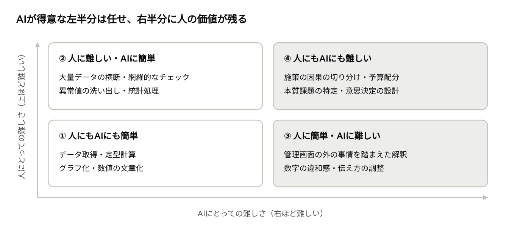
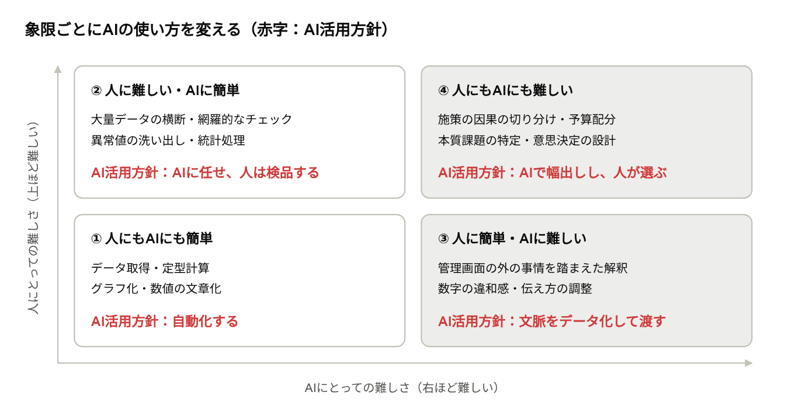

【BizDev公開日誌 #13】

半年前、私たちは[#1](https://note.com/novasell_baba/n/nac2d03db35de)でこう書きました。「確率の管理」はAIに任せ、「価値の創造」は人間が握る。

いまでも間違っていないと思っています。ただ、いざ実務レベルでの「AIと人の役割分担」をチームで考え始めたら、この言葉だけでは前に進めませんでした。判断の責任を取る力、関係を築く力、問いを立てる力。出てくる言葉はどれもその通りですが、どれもAIが来る前から「プロとして磨くべき能力」として言われてきたことでした。

[PUNCHLINE] 正しい。けれど、何も言っていなかった。

足りなかったのは正しさではなく、解像度です。そこで今回は、業務を細かく刻んで「AIに渡す部分」と「人が身につける部分」を仕分け直した話をします。

## 「人にとっての大変さ」と「AIにとっての大変さ」を分けて見る

仕分けに使う軸は２つ。１つ目は「人にとっての難しさ」で、作業量の多さ、一度に扱える情報量、想像力の必要度合いと連動します。２つ目は「AIにとっての難しさ」で、必要な情報がデータやテキストとしてAIに渡せる状態にあるか、そして正解が存在するかと連動します。

大事なのは、AIにとっての難しさの多くは「能力の限界」ではなく「情報の不足」であるという点です。Web広告でいえば完全に管理画面の数字集計だけであればAIにとっては簡単なタスクにできます。他方、施策の前後関係やクライアントの社内事情などがデータ化されていない場合、それらを加味した解釈や示唆を出すことはAIには難しくなります。もちろん、そもそも正解がない、誰にもわからない問題は、人にもAIにも難しいままです。

例えば、広告のレポート業務を切り取って、この２つの判断軸で４象限を切ってみると、下記のように整理できると思います。左半分はAIに任せられる領域、右半分は今のところ人の判断が価値を持つ領域です。

## ① 人にもAIにも簡単な業務

「手順が決まっていて、正解が一つに決まる作業」は人にもAIにも簡単な業務です。広告レポートであれば管理画面の数字のハンドリングだけで完結し、誰がやっても同じ結果になるものがここに入ります。

- 管理画面やAPIからのデータ取得、レポートフォーマットへの流し込み
- CPA・ROAS・CTR・前月比などの定型計算
- グラフ作成や、「CPAは前月比12%改善」のような数値の文章化

人にとっても難しくはありませんが、毎週・毎月繰り返すと膨大な時間を奪いミスをする可能性もある作業のため、AI化の意味があります。その際、AIに推論で計算させると、転記ミスや桁違いが起きることがあるため、計算はコード実行やスプレッドシートの関数に任せ、AIには結果の文章化を担当させるといった設計が必要です。

## ② 人に難しく、AIには簡単な業務

「必要な情報はすべてデータの中にあるが、量が多すぎて人の処理能力を超える作業」は人にとっては難しい（大変）でAIには簡単な業務です。人間の限界は、能力よりも集中力と時間にありますが、AIはその両方の制約を受けないため、AI化の意味が最もある「AIの得意業務」といってもいい領域です。

- 複数媒体・大量のキャンペーンや検索語句を横断した傾向把握
- 細かい変動の網羅的なチェックと、異常値の洗い出し
- 有意差検定や回帰分析などの統計処理

## ③ 人に簡単で、AIには難しい業務

「複数の情報を組み合わせないと、正しく解釈できない作業」は人にとっては比較的容易でAIには難しい業務です。担当者なら当たり前に知っている文脈が、データとしてどこにも残っていない。それがAIにとっての壁になります。

実際、レポートの解釈や示唆をクライアントにとって価値のある形に整えるには、市場トピックやクライアントの状況や好み、施策の前後関係などを加味する必要があり、この点がAIにただレポート作成を依頼しても納得いく出来に到達しない大きな要因といえます。

- 管理画面の外の事情を踏まえた解釈（その週はセール中だった、TVで紹介された、LPを改修した、在庫切れだった）
- 「なんか変」という違和感の察知（タグの二重発火、計測漏れ）
- 担当者が上に報告しやすいように強調点を変える、言いにくい結果の伝え方を調整する

重要なのは「AIにとっての難しさ」はAIの能力不足ではなく情報不足で生まれるということです。つまり、文脈をデータとして渡せるようになれば、多くは②や①の側に移っていきます。これらのデータを取得し、AIが動くような適切な加工やプロセスを作れると、逆にAIの「過去の出来事を忘れない」という強みに裏返るため、長い目で見た際にはAI活用における非常に重要な領域にもなります。

## ④ 人にもAIにも難しい業務

「そもそも正解が誰にもわからない問題」はAIにとっても人にとっても難しい業務です。こここそが冒頭にあった「問いを立てる力」にも近いどれだけデータを集めても、最後は推定や仮説でしか答えられないプロが磨くべき領域と言えるかと思います。

- 施策ごとの本当の効果の切り分け（その広告がなかったら売れていなかったのか、という因果の判断）
- 最適な予算配分の決定
- 成果不振の本質的な原因が、広告なのか、商品・LP・営業なのかの見極め

一流のマーケターと平均的な担当者の差がもっとも大きく出る業務ゆえ、AIという過去のデータから「いちばんありそうな答え」を出すのが得意な仕組みにはなかなか解消できない、属人性が効く領域です。これも冒頭「正しい」としたように、AI時代においてこの能力を磨くことは人間が出せる価値を最大化する上でより重要になってきていると考えられます。

## AI活用の道筋

AI活用は、①②の自動化から始めて、③を縮め、④の判断を支える、という3段階で進めるのが現実的と考えられます。

### ステップ1：①と②を自動化する

データ取得から集計、グラフ作成、一次コメントまでをAIに任せます。

ここで浮いた時間が、後のステップに投資する原資になります。前述の通り、計算は必ずコード実行で行わせ、数字の正確さを担保します。

### ステップ2：③を「文脈のデータ化」で縮めていく

③がAIに難しいのは、情報が足りないからなので、施策カレンダー、クライアントの事情メモ、定例の議事録、計測設定の変更ログなどを蓄積し、AIに渡せる形にしていきます。担当者の頭の中にしかなかった文脈がテキストになるほど、③の業務は①②の側へ移っていきます。

### ステップ3：④はAIで仮説を広げ、人が選ぶ

④は答えそのものが存在しないので、AIに答えを出させるのではなく、考えられる原因や打ち手を網羅的に出させます。そのうえでMMMやリフト調査で検証し、最終判断は人が行います。AIによって検証のサイクルが速く回るほど、判断の精度も上がっていきます。

## おわりに：AIの得意・不得意を見極める力

ここまでまとめてきたように、AIにどこまで任せるかは、「AIが賢いかどうか」ではなく、「必要な情報をAIに渡せるか」「そもそも正解があるか」で決まります。そしてこの見極めこそが、AI時代に人間に新しく求められる能力だと考えています。

AIに任せすぎれば、③の文脈が抜け落ちた「数字は正しいが的外れなレポート」が量産されます。逆にAIを全く信用しないと①②に人の時間を奪われ続け、本来人が向き合うべき④の判断に手が回りづらくなり、使っている人との差が開き続けます。

私たちは今回の分類に沿って、業務の仕分けの精度を高めながら進めることが、事業と業務の両方で成果につながるAI活用を進めていきます。

---

## 次に読む

この記事が参考になったら、ぜひ以下もご覧ください。

https://note.com/novasell_baba/n/nac2d03db35de
<!-- カードリンク: 【BizDev公開日誌 #1】マーケティング事業をAIで変革するとき、「成果」のレバーになるのは何なのか。note入稿時、上のURL単独行が自動でカード化されます -->

https://note.com/rapid_yeti215/n/n912be35cd5f6
<!-- カードリンク: 【BizDev公開日誌 #2】AIエージェントで広告運用を自動化して見えた「暗黙知」の壁。note入稿時、上のURL単独行が自動でカード化されます -->

## BizDev公開日誌シリーズ

https://note.com/novasell/m/meb016eadab77
<!-- カードリンク: ノバセル｜bizdev note マガジン -->

---

#AIBizDev #ノバセルBizDev #AI事業開発 #AI活用 #業務効率化
