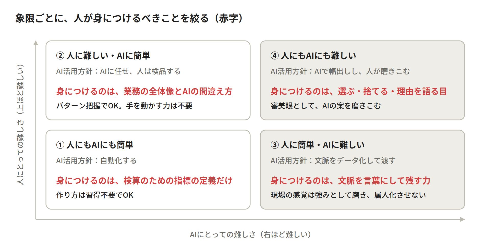
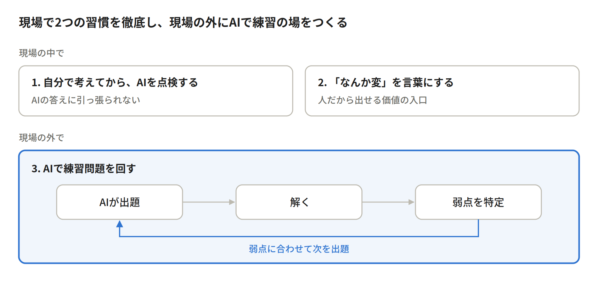

【BizDev公開日誌 #14】

前回の[#13](https://note.com/novasell_baba/n/nc5b3c6cb6643)では、広告レポートの業務を「人にとっての難しさ」と「AIにとっての難しさ」で4つの象限に分け、どこをAIに渡すかを決めました。今回はその続きです。

ノバセルでは広告代理事業の各業務でのAI活用、あるいはAI Nativeな形での業務の再設計を行っているのですが、組織としての競争力を培うためには「AIを活用した仕組みや業務を作ること」と同等かそれ以上に、「それらの仕組み・業務を前提とした時の人材育成の設計」を深めることが重要となります。

AIによって人間が価値を発揮すべき業務が変わるなかで、人が身につける能力がどう変わり、その能力をどう再現性高く獲得できるようなプロセスにするのか？今回はその問いについて考えます。換言すると、AIを前提にした時に「どのような能力を身につけるべきか」を見極め直し、AIの代替範囲が広がることによる「新人が育たなくなる」問題への手当てを考えます。

## 象限ごとに「どこまで身につけるか」を決める

前回整理した以下の象限に沿って考えます。

1. **人にもAIにも簡単**
   データの自動取得・定型計算・定型グラフ化などが該当し、AIで自動化する象限
2. **人に難しい・AIに簡単**
   大量データの横断チェック・異常値検知などが該当し、AIに任せ人が検品する象限
3. **人に簡単・AIに難しい**
   背景情報を踏まえた解釈や伝え方の調整などが該当し、AIへ渡す文脈データ整備が肝になる象限
4. **人にもAIにも難しい**
   施策効果の真因深掘りや本質的な課題の特定などが該当し、AIで幅出しし人が磨き込む象限

例えば、①と②をAIに渡すなら、新人に集計やグラフ作りを一から教える必要はもうないのか。逆に、何を教えれば「AIに任せる側」に立てるのか。私たちは、身につけるべきこと、逆に不要なことを整理すると下記のようになります。

上記の①②を渡すならの問いに答えるとすると、AIによるミスが起きうるポイント・落とし穴の把握（AIの苦手を把握すること）を把握した上で、ミスがないように検品・検算が漏れなくできることは重要になります。自分自身でそれらの作業を高速で実施したりする能力は基本的には不要になるのですが、ミスを指摘すること自体は必須となるということです。

## 新人が育つ場所が消える論の捉え方

私たちの議論で一番引っかかったのはここです。①と②は積極的にAIに渡すべき象限ですが、従来新人の仕事として渡され、数をこなす中で人材として育つプロセスだったようにも感じられます。毎日数字を集計するうちに数字への違和感が身に付くなどの経験知が身につくイメージです。ここがなくなることで新人が育つ場所がなくなるのではないか？AI活用と同居できないリスクがあるのではないか？という議論になったのです。

本稿では割愛しますが、実際に世界ではすでに企業の判断としての若手の採用減や、新人育成や学校教育の場でのAI導入後にAIを無くした場合の能力の低下の例も見られ始めています。

広告のレポートに置き換えると、集計をAIに任せた新人は、数字の異常に自分で気づく練習をしないまま担当を持つことになり、AIに任せた分の基礎は失われ、有事の品質低下が起きる可能性があります。

## 育つ場所を作り直す3つの打ち手

このようなリスクを回避するために「新人が育つ場所」を再定義する３つの打ち手が大事だと考えています。

1. **点検役を若手に任せ、先に自分で考えさせる**
   AIの答えを先に見ると人はそれに引っ張られます。逆に言うと、AIの答えを見る前に自分で考えさせる仕掛けで、AIの誤りを鵜呑みにすることは減るということです。面倒に感じられても、この順番を徹底することは重要です。
2. **「なんか変」を言葉にして報告させる。**
   違和感を感じられることは、人だから発揮できる価値（③の背景情報に紐づく分析や④の真因の深掘り）の入口です。言葉になった違和感を最低限言語化する習慣をつけることは徹底して行うべきです。
3. **型を決めた練習問題を作る**
   上記２つの取り組みに対し、あえて現場の案件軸から離れ、AI時代だからこそできる場所の定義も考えられます。例えば、分析業務で発生するパターンを事前に定義し、それらの練習問題を大量にAIに作らせる。そしてその正答状況を踏まえて個人ごとに弱点を浮き彫りにするといった、いわばアダプティブラーニングのような場はAI時代だからこそ提供できる形です。定義したパターンの充実化自体も日々の業務から抽出し、アップデートし続けることもできます。この方向は、従来の現場ベースでの育成だと経験に偏りが出ることもありえた中で、幅広いパターンを一気に習得できるポテンシャルも秘めていると思います。

## アプリを配るだけでは変わらない

繰り返し、新人が担っていた業務をAIによって無くしていく方向に組織として舵を取る中で、次の世代がどこで育つのかという問いが必ず残ります。今回はその課題に対する答えを考えました。

AIで構築したモジュールを「アプリ」と捉えたときに、私たちが作ろうとしているのは「アプリ」ではなく、実際にクライアントの広告成果を出し続けるために稼動するアプリを動かす業務や人も含む「OS」です。OSが古いままでは、優れたアプリも価値を生みません。

AIの出力を疑いレビューする力も、文脈を言語化し正しくインプットする力も、放っておいたら育ちません。AI時代になった育成のあり方を作り直すことは、AI活用の精度を高めることと表裏一体だと捉え、アプリで止まらず、人が育ち活躍するOSを作っていければと考えています。

---

## 次に読む

この記事が参考になったら、ぜひ以下もご覧ください。

https://note.com/novasell_baba/n/nc5b3c6cb6643
<!-- カードリンク: 【BizDev公開日誌 #13】「問いを立てる力が大事」では、何も決まらない。note入稿時、上のURL単独行が自動でカード化されます -->

https://note.com/novasell_baba/n/nac2d03db35de
<!-- カードリンク: 【BizDev公開日誌 #1】マーケティング事業をAIで変革するとき、「成果」のレバーになるのは何なのか。note入稿時、上のURL単独行が自動でカード化されます -->

## BizDev公開日誌シリーズ

https://note.com/novasell/m/meb016eadab77
<!-- カードリンク: ノバセル｜bizdev note マガジン -->

---

#AIBizDev #ノバセルBizDev #AI事業開発 #AI活用 #人材育成
